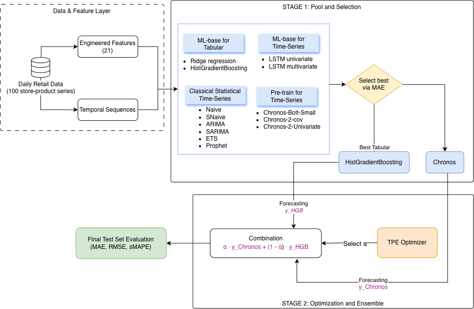

# Hybrid Retail Demand Forecasting with Pretrained Time-Series Models and Business Signals

This is our official implementation for the paper:

> Thanh Thao Nguyen and Hung-Nghiep Tran (2025). **Hybrid Retail Demand Forecasting with Pretrained Time-Series Models and Business Signals**. Under review at the *12th International Conference on Future Data and System Engineering (FDSE 2025)*, Springer CCIS/LNCS.

Authors: 
* **Thanh Thao Nguyen** (`thaont.20@grad.uit.edu.vn`)
* **Hung-Nghiep Tran** (`nghiepth@uit.edu.vn`, Corresponding author)

*University of Information Technology, Vietnam National University, Ho Chi Minh City, Vietnam.*

---

## Introduction

Accurate retail demand forecasting is essential for supply chain management, yet challenging due to the interaction between temporal dynamics and exogenous business signals like promotions and inventory levels. While pretrained time-series foundation models achieve strong zero-shot performance on generic benchmarks, their effectiveness in covariate-rich retail environments remains unclear.

To address this gap, we propose **ChroBoost**, a lightweight two-stage prediction-level ensemble framework combining zero-shot Chronos models with Optuna-tuned HistGradientBoosting (HGB) across two variants (**Chronos-2-cov + HGB** and **Chronos-Bolt-Small + HGB**). This design enables the model to leverage general temporal priors while capturing complex supply-side covariates. Under a unified, leakage-aware rolling $H=7$ evaluation protocol across 15 forecasting approaches on a 100 store-product dataset, our Chronos-Bolt + HGB hybrid achieves **26.04 test MAE** and **29.40% test sMAPE**, offering modest overall gains over standalone baselines while effectively mitigating error concentration during promotional spikes and peak-demand periods.

<p align="center">
  
  <br>
  <em>Figure 1: Two-Stage Framework for Model Selection and Ensemble Learning.</em>
</p>

---

## Citation

If you find our work, code, or benchmark setup useful in your research, please cite:


---

## Environment Requirement

The code has been tested running under **Python 3.10+**. The required packages are as follows:

* `torch >= 2.1.0`
* `chronos-forecasting >= 0.0.4`
* `scikit-learn >= 1.3.0`
* `optuna >= 3.3.0`
* `statsmodels >= 0.14.0`
* `prophet >= 1.1.5`
* `pandas >= 2.0.0`
* `numpy >= 1.24.0`
* `scipy >= 1.10.0`
* `matplotlib >= 3.7.0`
* `seaborn >= 0.12.0`
* `jupyter` / `ipykernel`

To set up the environment:

```bash
git clone https://github.com/ngyxntthaoo/Ensembling-TS-Tabular-Retail-Demand-Forecasting.git
cd Ensembling-TS-Tabular-Retail-Demand-Forecasting

# Create and activate virtual environment
python3 -m venv venv
source venv/bin/activate  # On Windows: venv\Scripts\activate

# Install dependencies
pip install --upgrade pip
pip install torch --index-url https://download.pytorch.org/whl/cu118  # or CPU / MPS
pip install "chronos-forecasting" "scikit-learn" "optuna" "statsmodels" "prophet" pandas numpy scipy matplotlib seaborn jupyter
```

---

## Dataset

We evaluate on the publicly available **Retail Store Inventory and Demand Forecasting** benchmark:

* **Source**: [Kaggle Dataset](https://www.kaggle.com/datasets/atomicd/retail-store-inventory-and-demand-forecasting) by Zhenzuo Zhu (DOI: `10.34740/KAGGLE/DSV/11895299`).
* **Scale**: 76,000 daily observations from January 1, 2022 to January 30, 2024 across 5 retail stores and 20 products (100 distinct Store–Product series).

The dataset file is located at `Model/dataset/sales_data.csv`.

---

## Reproducibility & Example to Run the Codes

To demonstrate reproducibility and allow researchers to replicate the exact results reported in our paper, the full end-to-end forecasting pipeline is provided in: `Model/src/horizon-7-forecasting.ipynb`


You can run the experiment notebook via Jupyter Lab or VS Code:

```bash
jupyter lab Model/src/horizon-7-forecasting.ipynb
```

### Notebook Workflow Overview:

1. Exploratory Data Analysis (EDA)
2. Leakage-Aware Feature Engineering
3. Baseline Model Benchmarking
4. Hybrid Ensembling & Optimization
5. Evaluation, Statistical Tests & Ablations

---

## Main Results

All 15 models are evaluated under the unified, leakage-aware 7-day rolling forecasting protocol:

| Group | Model | Test MAE | Test RMSE | Test sMAPE (%) |
| :--- | :--- | :---: | :---: | :---: |
| **Classical** | Naive | 38.08 | 45.27 | 44.34 |
| | Seasonal Naive | 39.63 | 48.69 | 46.30 |
| | ARIMA | 29.50 | 36.81 | 33.59 |
| | SARIMA | 29.62 | 36.87 | 33.70 |
| | ETS | 29.66 | 37.06 | 33.82 |
| | Prophet | 31.40 | 39.72 | 37.83 |
| **Machine Learning** | Ridge Regression | 27.24 | 33.26 | 30.60 |
| | HistGradientBoosting (HGB) | 26.34 | 32.45 | 29.83 |
| **Deep Learning** | LSTM (Univariate) | 27.58 | 34.07 | 30.89 |
| | LSTM (Multivariate) | 27.45 | 33.52 | 30.67 |
| **Pretrained TSFMs** | Chronos-2 (Univariate) | 29.49 | 36.38 | 33.60 |
| | Chronos-2 (Covariate) | 29.12 | 36.30 | 33.05 |
| | Chronos-Bolt-Small | 28.94 | 36.01 | 32.76 |
| **Proposed Hybrid** | **Chronos-2 (cov.) + HGB** | **26.14** | **32.34** | **29.54** |
| | **Chronos-Bolt + HGB** | **26.04** | **32.23** | **29.40** |

---

## Contact

For questions, issues, or suggestions regarding the code and paper, please feel free to open an issue or contact:

* **Thanh Thao Nguyen**: `thaont.20@grad.uit.edu.vn`
* **Hung-Nghiep Tran**: `nghiepth@uit.edu.vn`
